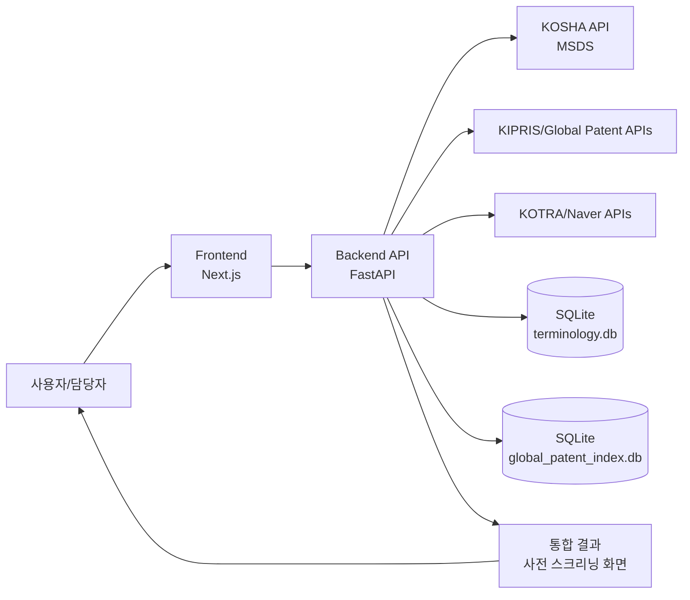
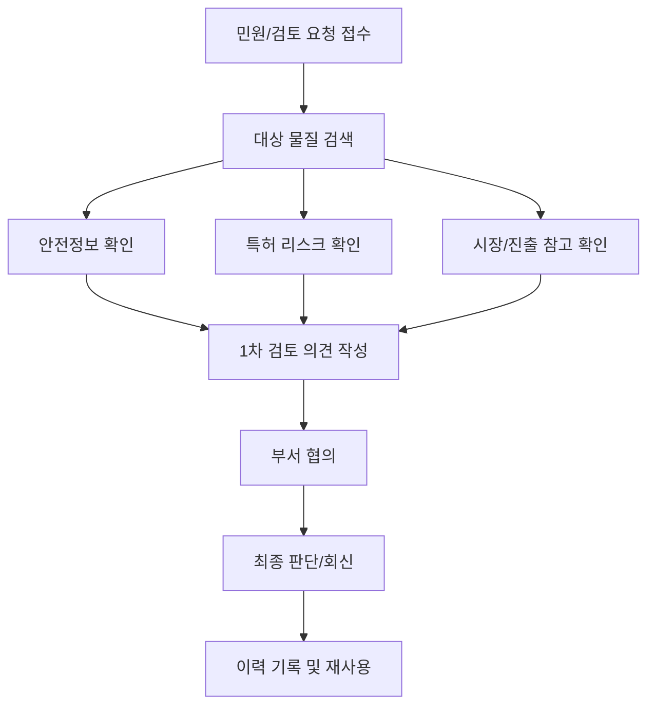

# ChemIP Platform 개념도 (Mermaid)

## 1) 서비스 개념도


## 2) 업무 활용 흐름도 (공무원 제출용)


## 3) 장애 대응 개념도 (Fallback)
```mermaid
flowchart LR
    Q[조회 요청] --> API{외부 API 응답 정상?}
    API -- 예 --> N[정상 응답 표시]
    API -- 아니오 --> L[대체 경로(fallback) 조회]
    L --> S[대체 데이터 표시 + 출처 표기]
    N --> END[업무 계속]
    S --> END[업무 계속]
```

## 활용 안내
- GitHub/Markdown 뷰어에서 Mermaid 지원 시 바로 렌더링됩니다.
- PPT 제출 시 Mermaid를 SVG/PNG로 내보내 삽입하면 선명도가 유지됩니다.
