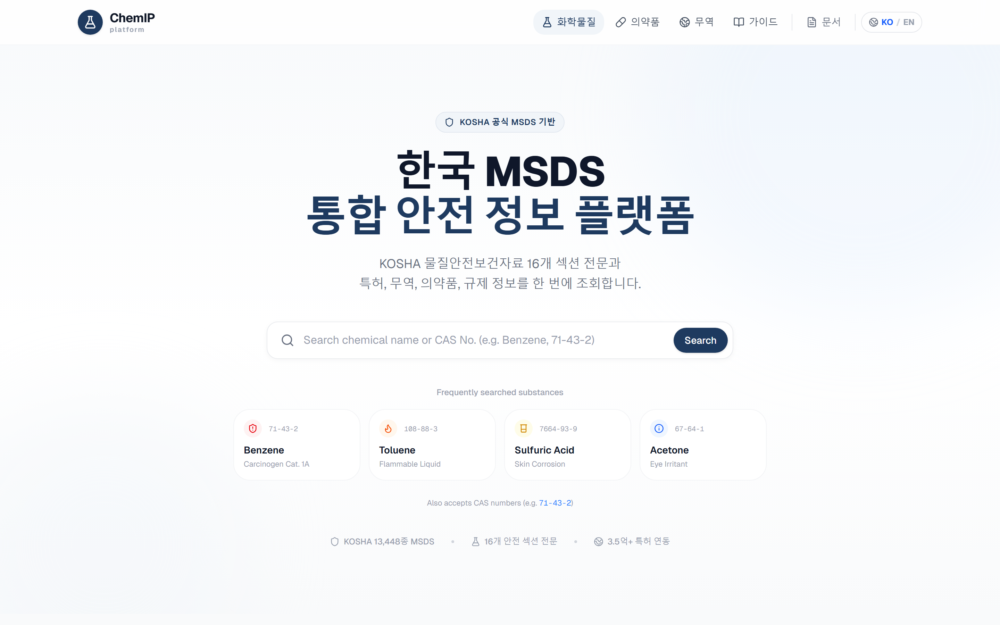
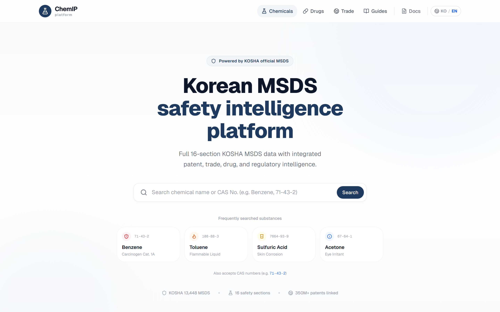
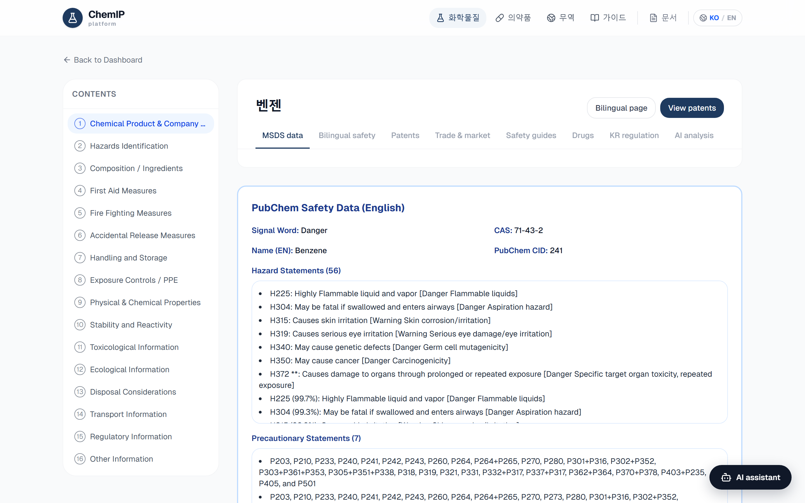
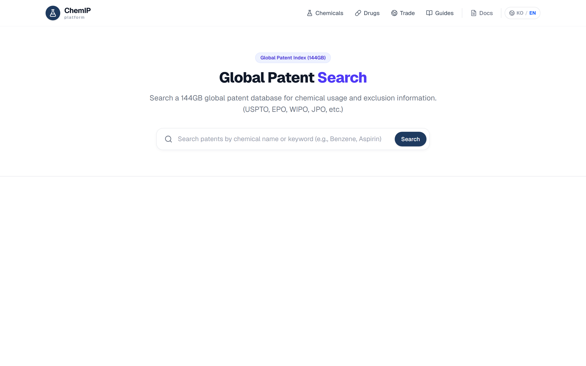
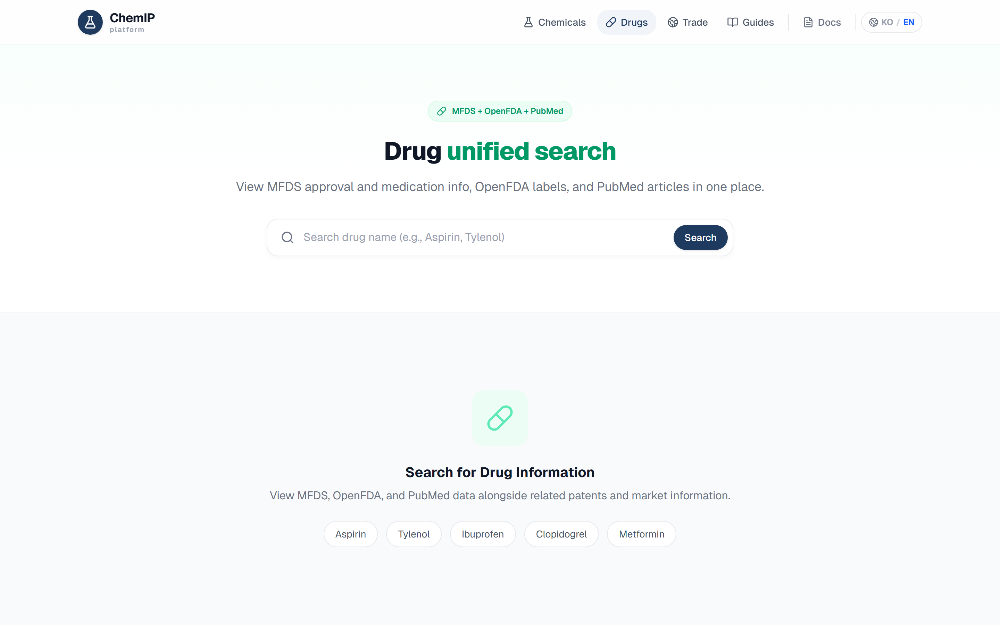
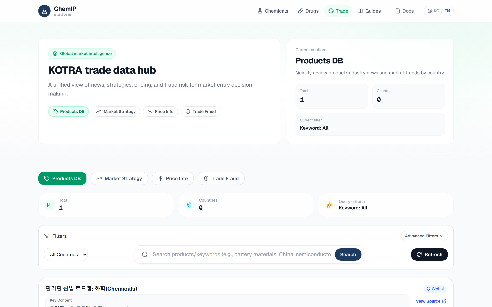
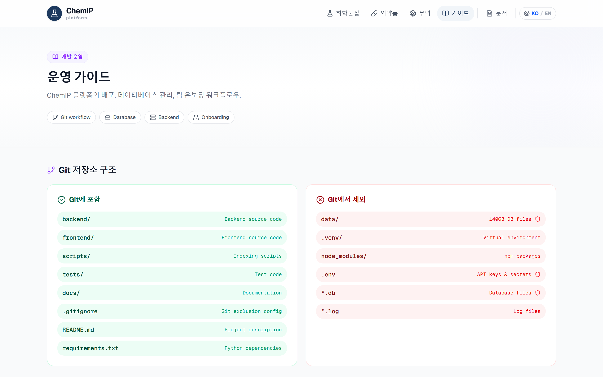

# Supporting Information

## ChemIP: An Open-Source Web Platform for Unified Chemical Safety Data Retrieval across Korean and International Regulatory Sources

Yuyong Kim

University of Wisconsin-Madison, United States

Email: ykim288@wisc.edu | ORCID: 0009-0006-4842-666X

---

## Table of Contents

- S1. Platform Installation and Configuration
- S2. API Endpoint Reference
- S3. Database Schema
- S4. User Interface Screenshots
- S5. Deployment Modes

---

## S1. Platform Installation and Configuration

### Prerequisites

- Python 3.11+ with pip
- Node.js 18+ with npm
- (Optional) Ollama for local LLM features

### Step 1: Clone and install dependencies

```bash
git clone https://github.com/yuyongkim/chemIP.git
cd chemIP

# Backend
pip install -r requirements.txt

# Frontend
cd frontend && npm install && cd ..
```

### Step 2: Configure environment variables

Copy `.env.example` to `.env` and provide the following API keys:

| Variable | Source | Required |
|----------|--------|----------|
| `KOSHA_SERVICE_KEY_DECODED` | Korea Occupational Safety and Health Agency | Yes |
| `KIPRIS_API_KEY` | Korea Intellectual Property Rights Information Service | Yes |
| `KOTRA_API_KEY_DECODED` | Korea Trade-Investment Promotion Agency | Yes |
| `DRUG_API_KEY_DECODED` | Ministry of Food and Drug Safety (MFDS) | Yes |
| `PUBMED_API_KEY` | NCBI E-utilities | No |
| `NAVER_CLIENT_ID` / `NAVER_CLIENT_SECRET` | Naver Developers (news fallback) | No |

All Korean government API keys are available at no cost through the respective open data portals (data.go.kr for KOSHA/MFDS, kipris.or.kr for KIPRIS, openapi.kotra.or.kr for KOTRA).

### Step 3: Start services

```bash
# Backend (FastAPI)
uvicorn backend.main:app --host 127.0.0.1 --port 7010

# Frontend (Next.js)
cd frontend && npm run dev
```

Access points after startup:

| Service | URL |
|---------|-----|
| Web interface | http://localhost:7000 |
| API server | http://localhost:7010 |
| Interactive API docs (Swagger) | http://localhost:7010/docs |
| Health check | http://localhost:7010/health |

### Step 4: Production deployment (optional)

For persistent operation, a PM2 process manager configuration is provided:

```bash
# Windows
start_all.bat

# Linux/macOS
bash start_all.sh
```

---

## S2. API Endpoint Reference

ChemIP exposes a RESTful API organized into seven route modules. All endpoints are prefixed with `/api/`.

### S2.1 Chemical Substance Endpoints (`/api/chemicals`)

| Method | Endpoint | Description |
|--------|----------|-------------|
| GET | `/` | Full-text search by chemical name or CAS number (paginated) |
| GET | `/autocomplete` | Typeahead suggestions for chemical names |
| GET | `/{chem_id}` | Retrieve complete MSDS data (all 16 sections) with GHS classification |
| GET | `/{chem_id}/drugs` | Linked pharmaceutical data for a chemical (MFDS/OpenFDA/PubMed) |

When a chemical detail is requested and MSDS sections are not cached locally, the system fetches all 16 sections from the KOSHA API in parallel and stores them for subsequent requests.

### S2.2 Patent Endpoints (`/api/patents`)

| Method | Endpoint | Description |
|--------|----------|-------------|
| GET | `/` | Search Korean patents via KIPRIS keyword query |
| GET | `/kipris/{application_number}` | Retrieve detailed KIPRIS patent record |
| GET | `/uspto/{chem_id}` | Search local USPTO patent index by chemical identifier |
| GET | `/global/{chem_id}` | Search global patent index (USPTO/EPO/WIPO/CN/JP/KR) |

The global patent index contains 350M+ patent records stored in a local SQLite database (134.5 GB), enabling sub-second full-text search without external API calls.

### S2.3 Drug and Pharmaceutical Endpoints (`/api/drugs`)

| Method | Endpoint | Description |
|--------|----------|-------------|
| GET | `/approval` | MFDS drug approval database search |
| GET | `/easy` | MFDS consumer medication information |
| GET | `/openfda` | US drug labels by brand, generic, or substance name |
| GET | `/pubmed` | Biomedical literature search (multi-query: base + toxicology + safety) |
| GET | `/unified` | Parallel search across all three sources (MFDS + OpenFDA + PubMed) |

### S2.4 Trade Intelligence Endpoints (`/api/trade`)

| Method | Endpoint | Description |
|--------|----------|-------------|
| GET | `/news` | KOTRA overseas market news |
| GET | `/strategy` | Market entry strategy reports by country |
| GET | `/prices` | Product price trend information |
| GET | `/fraud` | Trade fraud case database |
| GET | `/import-regulations` | Import restrictions by country |
| GET | `/naver-news` | Korean news search (Naver, fallback source) |

Additional endpoints exist for country information, enterprise success cases, and tourism data.

### S2.5 Safety Guide Endpoints (`/api/guides`)

| Method | Endpoint | Description |
|--------|----------|-------------|
| GET | `/status` | KOSHA guide dataset availability and statistics |
| GET | `/search` | Full-text search across KOSHA safety guides |
| GET | `/{guide_no}` | Retrieve detailed KOSHA safety guide by ID |
| GET | `/recommend/{chem_id}` | Recommended safety guides for a chemical (multi-criteria matching) |

### S2.6 AI Analysis Endpoints (`/api/ai`)

These endpoints require a local Ollama LLM server (default model: qwen3:8b).

| Method | Endpoint | Description |
|--------|----------|-------------|
| POST | `/analyze` | Multi-source safety analysis report (MSDS + patents + guides) |
| POST | `/summarize` | Comprehensive safety summary across all data sources |
| POST | `/drug-analysis` | Drug-chemical relationship analysis |
| POST | `/recommend` | Related chemical/keyword recommendations |
| POST | `/ask` | Natural language Q&A with full data context |
| GET | `/llm-status` | Check LLM server availability |

### S2.7 Regulatory Classification Endpoints (`/api/regulations`)

| Source | Endpoints | Data Provided |
|--------|-----------|---------------|
| ECHA (EU) | `/echa/search`, `/echa/clp/{id}`, `/echa/labelling/{id}` | REACH registration, CLP classification, harmonised labelling |
| EPA CompTox (US) | `/comptox/search`, `/comptox/hazard/{dtxsid}` | ToxValDB hazard data, cancer classification, functional use |
| NIOSH (US) | `/niosh/search`, `/niosh/cas/{cas}`, `/niosh/exposure/{cas}` | REL/PEL/IDLH exposure limits, PPE recommendations, carcinogen list |
| KISCHEM (KR) | `/kischem/search`, `/kischem/cas/{cas}` | Exposure symptoms, first-aid procedures |
| NCIS (KR) | `/ncis/cas/{cas}`, `/ncis/search` | Korean environmental substance classification |
| Aggregated | `/search` | Cross-source search (all five sources in parallel) |

Total: 80+ API endpoints across all modules.

---

## S3. Database Schema

ChemIP uses three local SQLite databases:

### S3.1 terminology.db (52.6 MB) — Primary chemical and MSDS database

**Table: `chemical_terms`** (117,744 rows)

| Column | Type | Description |
|--------|------|-------------|
| id | INTEGER PK | Internal row ID |
| name | TEXT | Chemical name (Korean or mixed) |
| cas_no | TEXT | CAS registry number |
| name_en | TEXT | English name (when available) |
| source | TEXT | Data source: KOSHA, ECHA, KREACH, KISCHEM, PUBCHEM |
| external_id | TEXT | External source identifier |

Source distribution: ECHA 80,534 (68.4%), KREACH 21,804 (18.5%), KOSHA 13,448 (11.4%), KISCHEM 1,954 (1.7%), PubChem 4 (<0.1%).

**Table: `msds_details`** (550,161 rows)

| Column | Type | Description |
|--------|------|-------------|
| chem_id | TEXT | Chemical identifier |
| section_no | INTEGER | MSDS section number (1-16) |
| xml_data | TEXT | XML-formatted section content from KOSHA API |

**Table: `msds_english`** (56,176 rows)

| Column | Type | Description |
|--------|------|-------------|
| chem_id | TEXT | Chemical identifier |
| cas_no | TEXT | CAS registry number |
| name_en | TEXT | English chemical name |
| pubchem_cid | INTEGER | PubChem compound ID |
| signal_word | TEXT | GHS signal word (Danger/Warning) |
| ghs_classification | TEXT | JSON array of GHS classifications |
| hazard_statements | TEXT | JSON array of H-statements |
| precautionary_statements | TEXT | JSON array of P-statements |
| pictograms | TEXT | JSON array of GHS pictogram codes |

**Table: `chemical_terms_fts`** — FTS5 virtual table for full-text search over name, cas_no, name_en.

### S3.2 global_patent_index.db (134.5 GB) — Global patent full-text index

Contains patent records from USPTO, EPO, WIPO, CN, JP, and KR patent offices with chemical name matching via FTS5 indexing.

### S3.3 uspto_index.db (5.8 GB) — US patent index

Dedicated USPTO patent index for faster US-specific patent queries.

---

## S4. User Interface Screenshots

The platform supports bilingual (Korean/English) operation. Representative screenshots from the live deployment (https://chemip.yule.pics) are shown below.

### Figure S1. Home page — Korean interface



The Korean home page displays "한국 MSDS 통합 안전 정보 플랫폼" (Korean MSDS Integrated Safety Information Platform) with KOSHA as the primary data source. Statistics show 13,448 KOSHA MSDS entries with full 16-section coverage and 350M+ linked patents.

### Figure S2. Home page — English interface



The same home page in English mode, demonstrating the bilingual toggle in the navigation bar. All UI labels, descriptions, and navigation items are translated.

### Figure S3. Chemical detail page (Benzene, CAS 71-43-2)



The chemical detail page for benzene showing: (left) table-of-contents sidebar for MSDS sections 1–16; (right) PubChem English safety data with GHS signal word, hazard statements (H225, H304, H315, H319, H340, H350, H372), and precautionary statements. Tabs provide access to bilingual safety view, patents, trade data, safety guides, drugs, Korean regulation, and AI analysis.

### Figure S4. Patent search interface



The patent search page providing access to KIPRIS (Korean patents) and the local global patent index (USPTO/EPO/WIPO/CN/JP/KR, 350M+ records).

### Figure S5. Drug cross-reference panel



The unified drug search interface combining MFDS (Korean drug approvals and consumer medication info), OpenFDA (US drug labels), and PubMed (biomedical literature) in a single query.

### Figure S6. Trade intelligence dashboard



The KOTRA trade data hub showing product database, market strategy, price information, and trade fraud tabs. The interface displays result counts, country coverage, and current filter criteria.

### Figure S7. Operations guide page



The operations guide page providing Git workflow documentation, database sharing methods, backend operation commands, and team onboarding checklists for platform deployment.

---

## S5. Deployment Modes

ChemIP supports three deployment configurations to accommodate different resource constraints:

| Mode | Components | Database | Storage | Use Case |
|------|-----------|----------|---------|----------|
| Minimal | Backend + Frontend | terminology.db only (53 MB) | ~200 MB | MSDS lookup and drug search |
| Standard | + KOSHA Guides + Ollama LLM | + guide dataset (~500 MB) | ~4 GB | Full safety analysis with AI |
| Full | + Global patent index | + patent DBs (140 GB) | ~145 GB | Complete platform with patent search |

All modes support the same API interface; unavailable features return graceful error messages rather than failing silently, consistent with the adapter-based graceful degradation design described in the main text.

---

*This Supporting Information accompanies the manuscript "ChemIP: An Open-Source Web Platform for Unified Chemical Safety Data Retrieval across Korean and International Regulatory Sources" submitted to ACS Chemical Health & Safety.*
